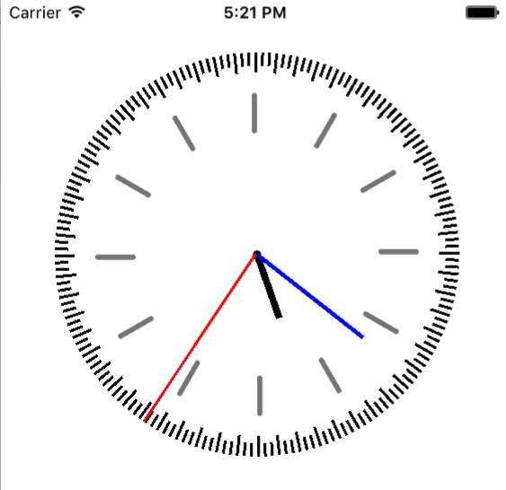

# clock-analog-coreanim

Created an analog clock for iOS using Core Animation in Objective C. 

This project is a fork of the project below. The project below is for MacOS, while this is for iOS. Also the frame has been replaced by CoreAnimation instead of a PDF
http://www.knowstack.com/coreanimation-analog-clock/

